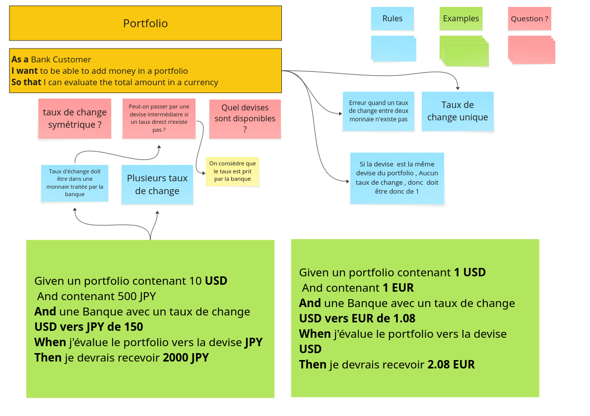

# Example Mapping

## Format de restitution

Pour chaque User Story, documenter les elements suivants.

## Evaluation d'un portefeuille

### User Story

Portfolio

- As a Bank Customer
- I want to be able to add money in a portfolio
- So that I can evaluate the total amount in a currency

### Questions

- Taux de change symetrique ?
- Peut-on passer par une devise intermediaire si un taux direct n'existe pas ?
- Quelles devises sont disponibles ?

### Regles Metier

- Erreur quand un taux de change entre deux monnaies n'existe pas
- Taux de change unique
- Si la devise est la meme que celle du portfolio, le taux de change est de 1
- Le taux de change doit etre dans une monnaie traitee par la banque
- Plusieurs taux de change possibles

### Exemples

1. Given un portfolio contenant 1 USD et 1 EUR, et une banque avec un taux de change USD vers EUR de 1.08, when j'evalue le portfolio vers USD, then je recois 2.08 EUR.

2. Given un portfolio contenant 10 USD et 500 JPY, et une banque avec un taux de change USD vers JPY de 150, when j'evalue le portfolio vers JPY, then je recois 2000 JPY.

### Photo

